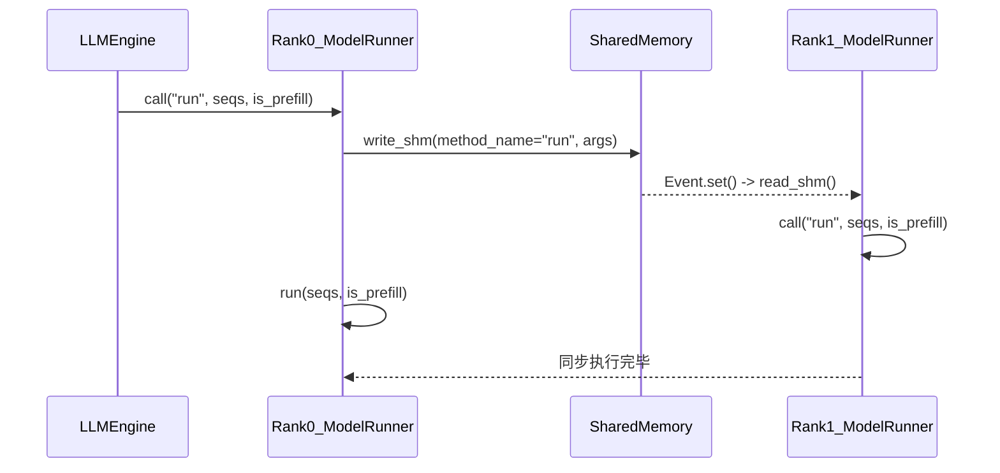

---

---
其实是 **Nano-vLLM 的多进程控制中枢**，是整个多 GPU（tensor-parallel）推理同步的核心。

这段设计看似简单，但其实背后有非常明确的分布式设计目的。下面我分三层来讲清楚它为什么要这么写。

---

## 🧩 一、设计背景：多 GPU + 多进程的控制问题

在 `LLMEngine` 初始化时，主进程（rank 0）会启动多个子进程，每个子进程都运行一个 `ModelRunner(config, rank=i, event)`。

- rank 0 → 主控制进程（负责任务调度、采样、协调）
- rank 1...N → 执行进程（负责部分模型权重的并行计算）

每个进程都各自有一份 `ModelRunner` 实例，但只有 rank 0 会直接被上层调用。

其他 rank 只在一个循环里等待命令：

```python
def loop(self):
    while True:
        method_name, args = self.read_shm()
        self.call(method_name, *args)
        if method_name == "exit":
            break


```

也就是说：

> rank 0 负责发“指令”，
> rank 1 负责“执行”，
> 
> 所以需要一个跨进程调用机制。

---

## ⚙️ 二、`call()` 的作用：实现一种简易的跨进程 RPC（远程过程调用）

`call()` 方法是这个 RPC 机制的封装：

### 🔹 1️⃣ 如果我是 rank 0

就把本次调用的命令（方法名 + 参数）广播给所有其他进程：

```python
if self.world_size > 1 and self.rank == 0:
    self.write_shm(method_name, *args)


```

`write_shm()` 会：

- 把指令序列化成 pickle 数据；
- 写入共享内存；
- 用 `Event.set()` 通知所有其他进程 “有新任务来了”。

每个从进程（rank > 0）则在 `loop()` 里 `read_shm()` 读出：

```python
method_name, args = self.read_shm()
self.call(method_name, *args)


```

于是它也会执行同样的 `call()`，调用本地同名方法。

### 🔹 2️⃣ 然后自己（rank 0）本地也执行

```python
method = getattr(self, method_name, None)
return method(*args)


```

所以所有进程都会执行同样的方法，只不过参数一致、时序同步。

这样一来：

- **rank 0** 做一次 `call("run", seqs, is_prefill)`；
- **rank 1...N** 通过 共享内存 和 事件 同步，执行各自的 `run()`；
- 整个 tensor-parallel 推理同时进行。

---

## 🧠 三、为什么不用 torch.distributed.rpc 或 multiprocessing.Queue？

这是一种**极简的轻量同步机制**，比 PyTorch 自带 RPC 更低开销，原因如下：

| 方法 | 优点 | 缺点 |
| --- | --- | --- |
| **PyTorch RPC** | 功能强、自动序列化 | 依赖 GIL / 通信开销高、RPC 管理复杂 |
| **multiprocessing.Queue / Pipe** | 简单易用 | 数据需多次拷贝、不能直接跨多 GPU 共享 |
| **共享内存 (SharedMemory) + Event** | 数据零拷贝（直接在内存映射上），多进程可见 | 需手动协议、手动同步 |

Nano-vLLM 这里选用：

- **SharedMemory** → 跨进程共享命令数据；
- **Event** → 同步信号；
- **pickle** → 序列化指令；
- **call()** → 统一封装调用逻辑。

这种组合有以下特点：

1. **零拷贝广播**：指令只写一次共享内存；
2. **同步执行**：所有 GPU 收到 Event 同时运行；
3. **代码通用性强**：`call()` 既能用于单 GPU（直接 call），也能用于多 GPU（广播 + call）；
4. **简化上层逻辑**：上层（LLMEngine）完全不用关心多进程同步，只写：
```python
token_ids = self.model_runner.call("run", seqs, is_prefill)


```

---

## 🧩 四、整体调用链示意图



---

## ✅ 总结一句话

> ModelRunner.call() 的这种设计本质上是一个轻量级多进程远程调用系统。
> 它让 rank 0 （主控制进程）只需调用一次，就能自动：
> 
> - 广播指令到所有 GPU 进程；
> - 同步执行相同的方法；
> - 同时兼容单 GPU （直接调用）和多 GPU 模式。

这种做法既**简单高效**，又**符合 Nano-vLLM 的极简端侧设计哲学** —— 不依赖复杂框架，只靠 SharedMemory + Event + pickle 实现分布式同步。

[[端侧抢占方案]]