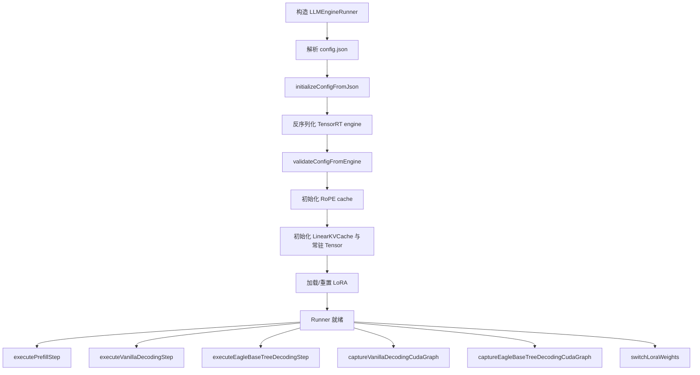
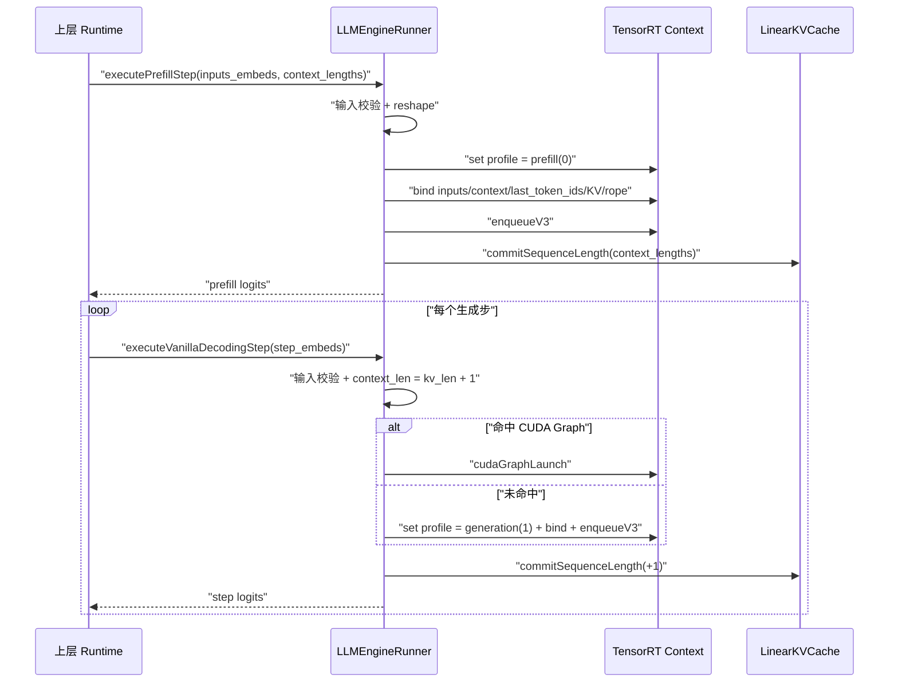

---

---

```mermaid

flowchart TD
    A["构造 LLMEngineRunner"] --> B["解析 config.json"]
    B --> C["initializeConfigFromJson"]
    C --> D["反序列化 TensorRT engine"]
    D --> E["validateConfigFromEngine"]
    E --> F["初始化 RoPE cache"]
    F --> G["初始化 LinearKVCache 与常驻 Tensor"]
    G --> H["加载/重置 LoRA"]
    H --> I["Runner 就绪"]

    I --> J["executePrefillStep"]
    I --> K["executeVanillaDecodingStep"]
    I --> L["executeEagleBaseTreeDecodingStep"]
    I --> M["captureVanillaDecodingCudaGraph"]
    I --> N["captureEagleBaseTreeDecodingCudaGraph"]
    I --> O["switchLoraWeights"]

```

```mermaid
sequenceDiagram
    participant RT as 上层 Runtime
    participant ER as LLMEngineRunner
    participant TRT as TensorRT Context
    participant KV as LinearKVCache

    RT->>ER: "executePrefillStep(inputs_embeds, context_lengths)"
    ER->>ER: "输入校验 + reshape"
    ER->>TRT: "set profile = prefill(0)"
    ER->>TRT: "bind inputs/context/last_token_ids/KV/rope"
    ER->>TRT: "enqueueV3"
    ER->>KV: "commitSequenceLength(context_lengths)"
    ER-->>RT: "prefill logits"

    loop "每个生成步"
        RT->>ER: "executeVanillaDecodingStep(step_embeds)"
        ER->>ER: "输入校验 + context_len = kv_len + 1"
        alt "命中 CUDA Graph"
            ER->>TRT: "cudaGraphLaunch"
        else "未命中"
            ER->>TRT: "set profile = generation(1) + bind + enqueueV3"
        end
        ER->>KV: "commitSequenceLength(+1)"
        ER-->>RT: "step logits"
    end
```